# Screenshots

Captured from the running app (Vite dev server + MSW mock backend), light theme.

## Storybook

The component workshop: full atomic-design sidebar taxonomy, with the `UsersTable` story fetching its rows through the MSW addon.

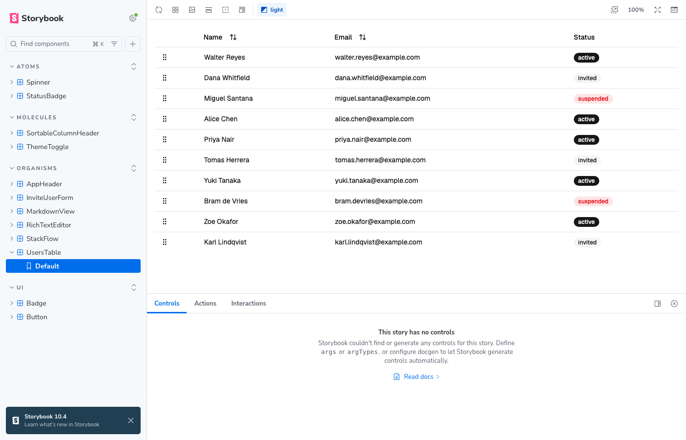

The theme toolbar set to dark on the `UsersTable` story — MSW-fed rows, drag handles, and badge variants all following the preview's `dark` class (the manager chrome is Storybook's own and stays light).

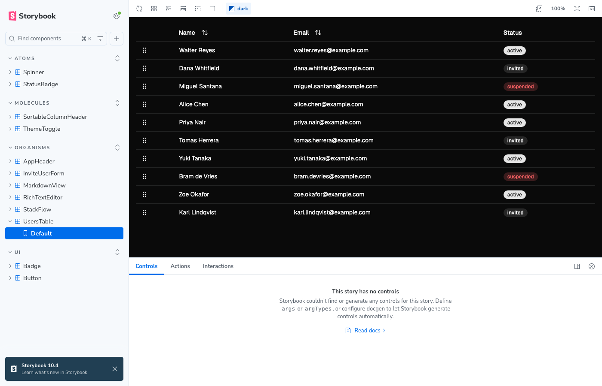

## Users table

The sortable users table: MSW-fed rows, dnd-kit drag handles, `StatusBadge` variants.

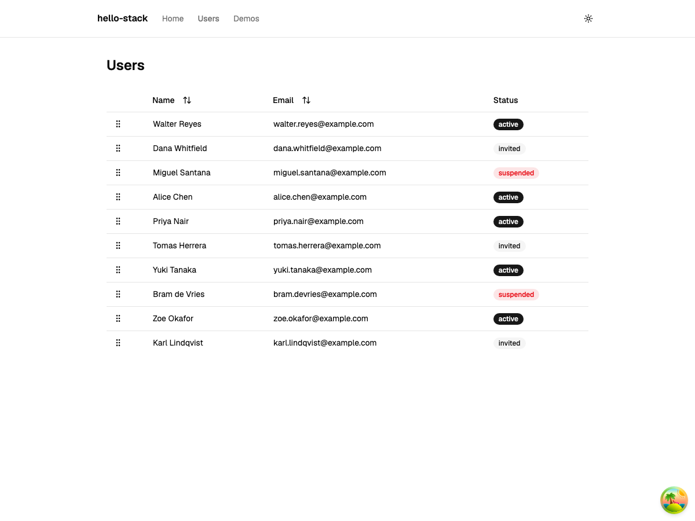

## Demos

The `/demos` section — every staged library exercised by a composed page.

### Overview

Motion-animated index cards; the palm-tree button (bottom right) is the dev-only TanStack Query devtools toggle.

### Rich text editor

tiptap → tiptap-markdown → `marked` round trip: bolded editor text, its markdown serialization, and the HTML preview.

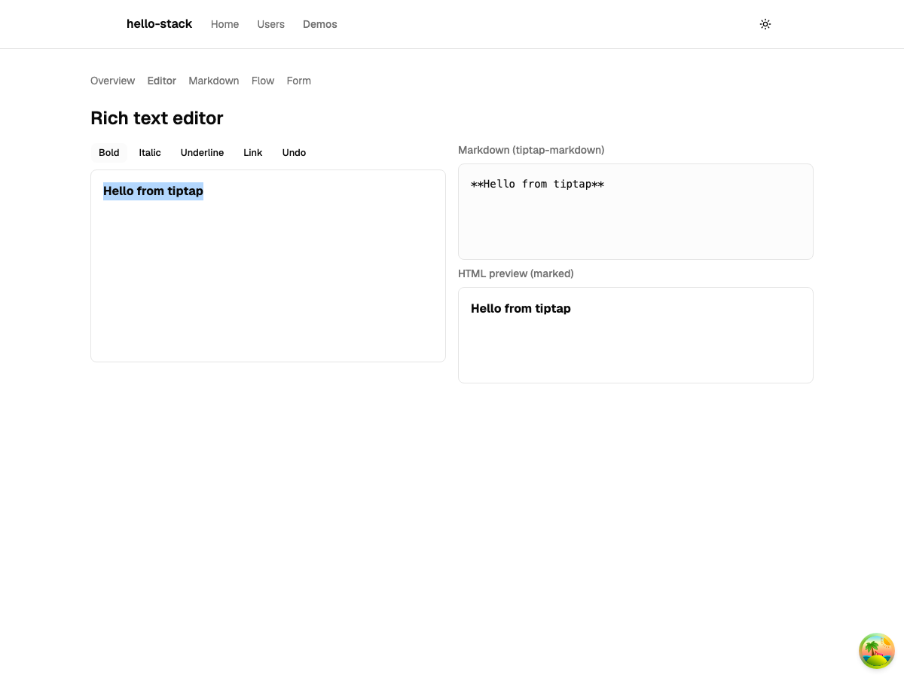

### Markdown pipeline

Streaming mode, mid-capture of "Stream it": streamdown replays the document from `GET /api/stream`, fed the app's own slim shiki (highlighted TypeScript) and tiny mermaid (rendered flowchart) through its plugin slots — one engine each, shared with the live-editing view on the left.

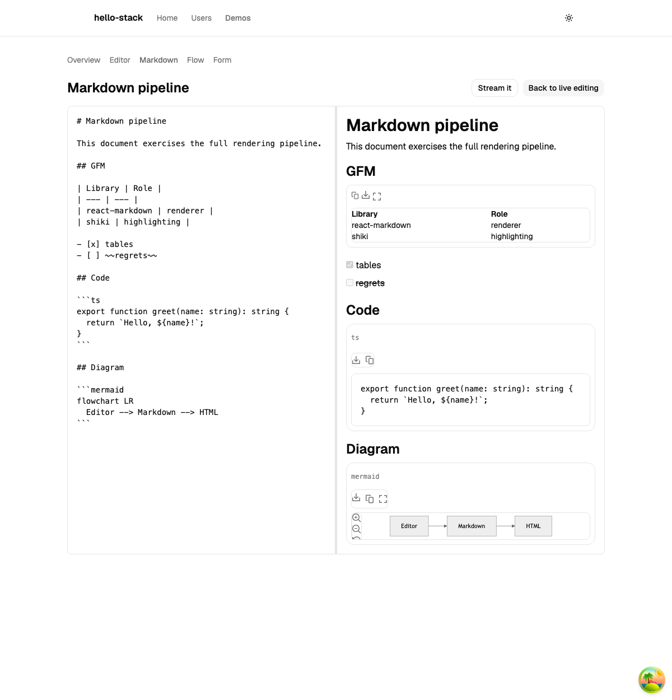

### Architecture flow

The repo's own architecture as a draggable xyflow canvas.

### Invite a user

react-hook-form + Zod with a completed submission — the confirmation id was assigned by the MSW handler after re-validating with the same `InviteUserSchema` the client used.

## Dark mode

Captured with the browser's color scheme set to dark and no toggle click — the `system` theme default resolving on its own. shadcn's `.dark` CSS variables, shiki's dual-theme output, xyflow's `colorMode="system"`, and mermaid (re-rendered with its dark theme via a class observer on `<html>`) all follow.

| | |
| --- | --- |
| 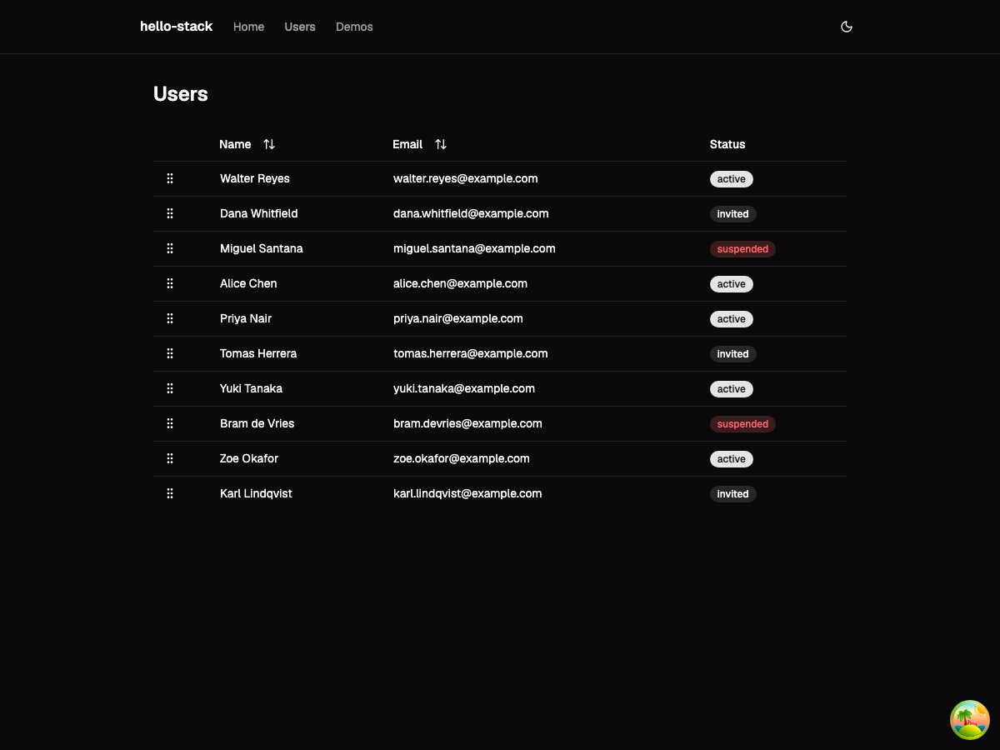 | 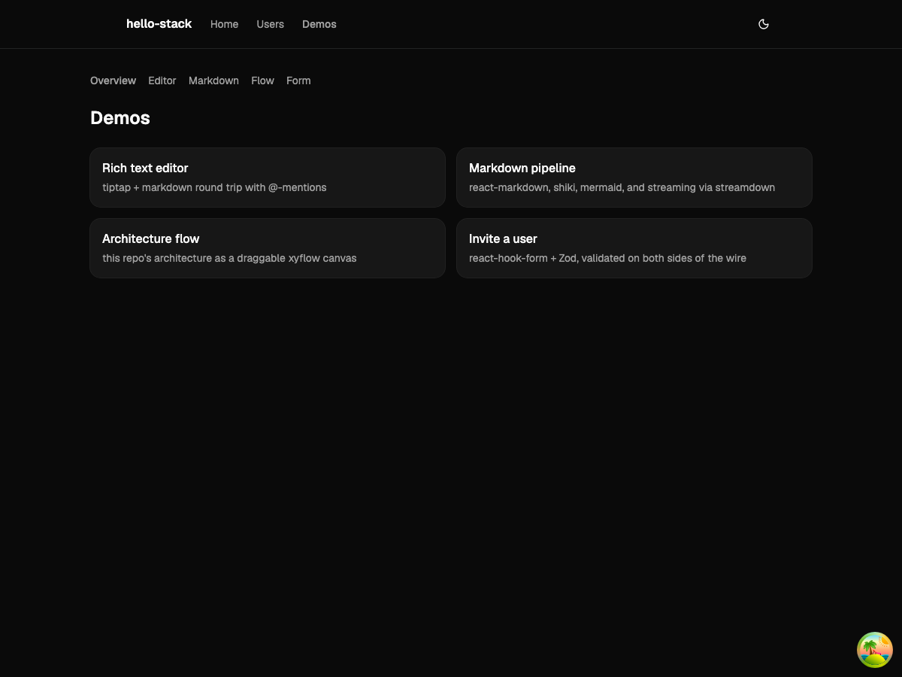 |
| 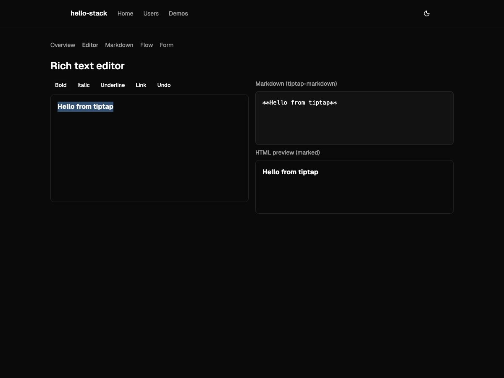 | 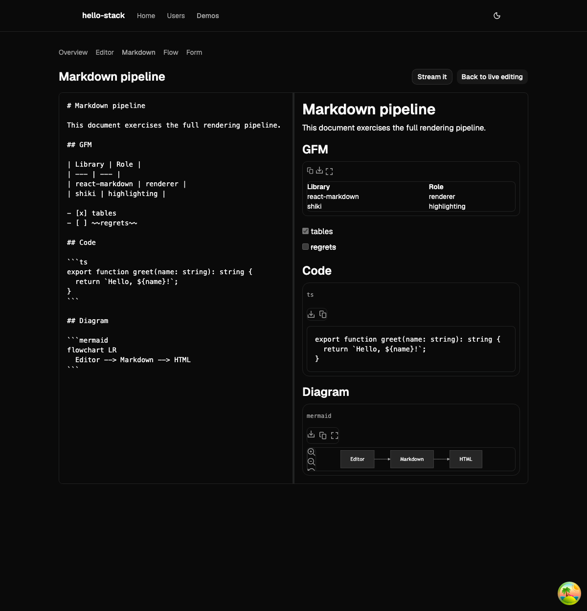 |
| 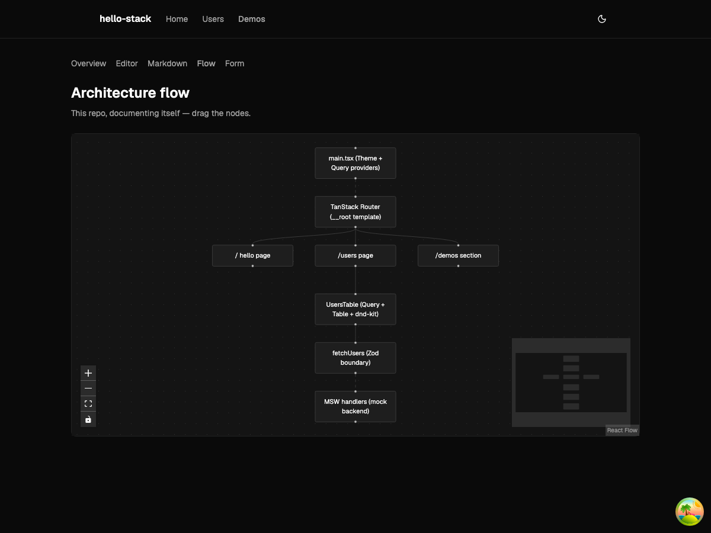 | 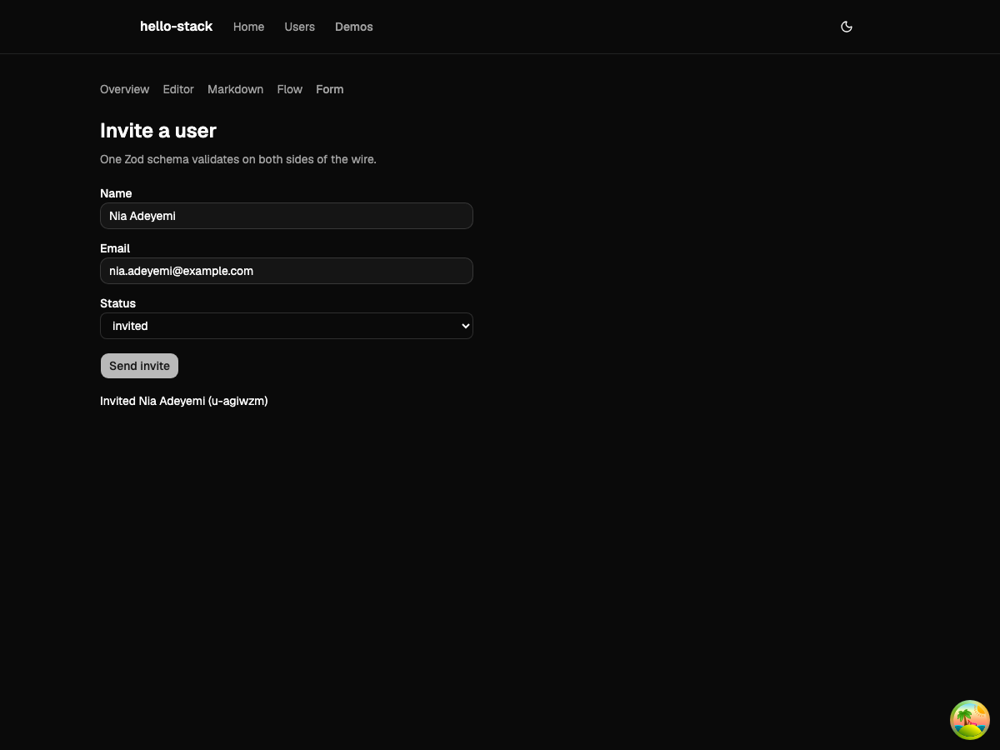 |
